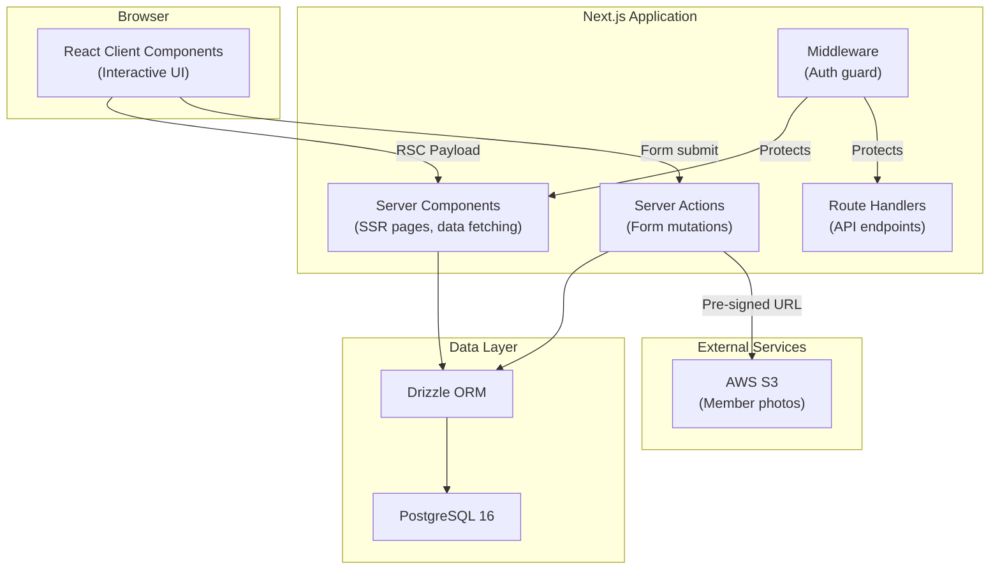
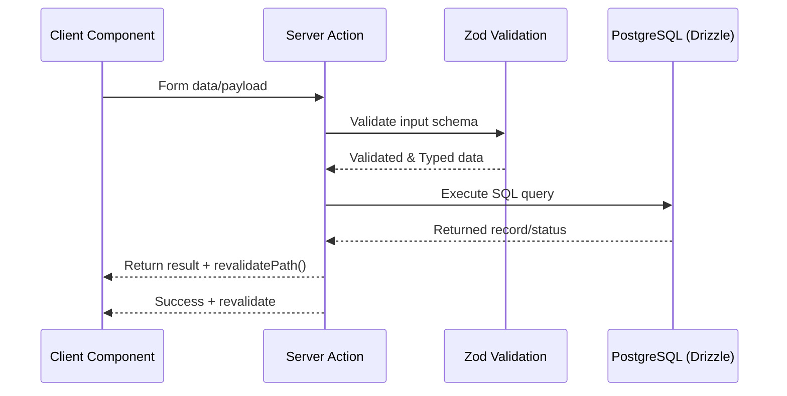

# Architecture — SNDP Salalah Membership Portal

> This document describes the system architecture. For technology decision rationale, see the [ADRs](./adr/).

## System Overview

A **super-admin portal** for managing members, recording membership payments, and tracking organizational income/expenses. Built as a **modular monolith** using Next.js App Router.

**Why modular monolith?** Single user (super admin), simple domain, small team. A monolith minimizes operational overhead while internal modules keep the code organized for future contributors.

---

## Architecture Diagram (C4 Container Level)



---

## Key Architectural Decisions

| Decision         | Choice                      | Rationale                                                      |
| ---------------- | --------------------------- | -------------------------------------------------------------- |
| **Framework**    | Next.js 16 App Router       | Server components, built-in routing, API routes in one package |
| **Rendering**    | Server Components (default) | Less JS shipped, direct DB access                              |
| **Mutations**    | Server Actions              | Type-safe, no REST boilerplate                                 |
| **ORM**          | Drizzle                     | Lightweight, SQL-first, zero codegen                           |
| **Auth**         | Auth.js v5 (Credentials)    | Free, middleware integration                                   |
| **File Storage** | AWS S3 + pre-signed URLs    | Direct upload, server stays lightweight                        |
| **Deployment**   | Vercel                      | Zero-config, PR previews                                       |

---

## Route Structure

```
app/
├── (auth)/login/         # Public routes
├── (portal)/             # Protected routes (middleware-guarded)
│   ├── dashboard/        # Overview page
│   ├── members/          # Member CRUD
│   ├── payments/         # Payment recording
│   └── finance/          # Income/expense tracking
└── api/
    └── health/           # Health check endpoint
```

---

## Security Layers

1. **HTTPS** — TLS encryption (Vercel handles this)
2. **Middleware** — Auth.js session check on every request
3. **CSRF** — Auth.js built-in token validation
4. **Input Validation** — Zod schemas on all inputs
5. **Parameterized Queries** — Drizzle ORM prevents SQL injection
6. **Pre-signed URLs** — Time-limited S3 access
7. **Secretlint** — CI scans for credential leaks

---

## Data Flow: Standard Mutation Pattern

> Next.js App Router relies on Server Actions to handle secure data mutations from client components.



---

## Related Documentation

- [Database Design](./DATABASE.md) — ER diagram, table schemas, indexing
- [Migration Plan](./MIGRATION.md) — MongoDB → PostgreSQL strategy
- [Architecture Decision Records](./adr/) — Why we chose each technology
