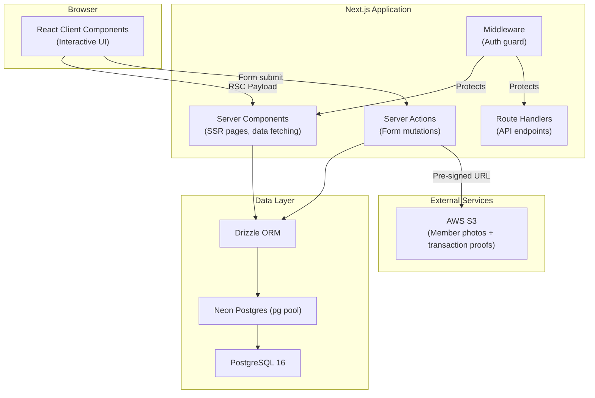
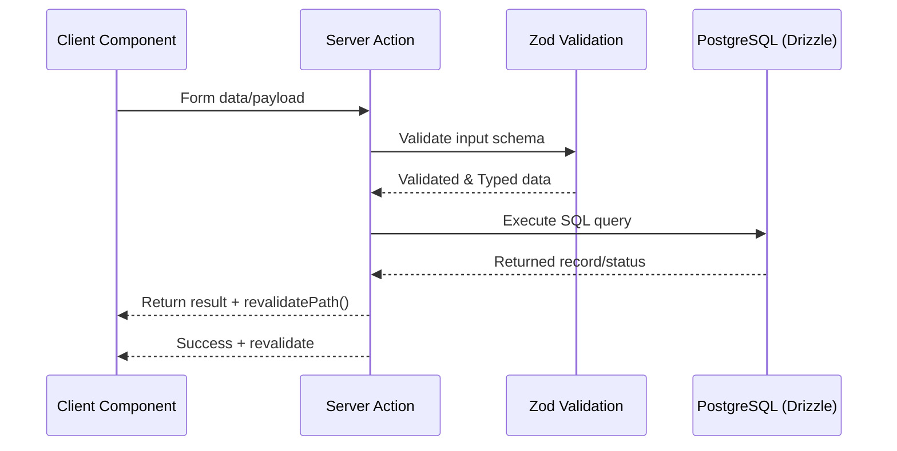

# Architecture — SNDP Salalah Membership Portal

> This document describes the system architecture. For technology decision rationale, see the [ADRs](./adr/).

## System Overview

A **super-admin portal** for managing members, recording membership payments, and tracking organizational income/expenses. Built as a **modular monolith** using Next.js App Router.

**Why modular monolith?** Single user (super admin), simple domain, small team. A monolith minimizes operational overhead while internal modules keep the code organized for future contributors.

---

## Architecture Diagram (C4 Container Level)



---

## Key Architectural Decisions

| Decision         | Choice                         | Rationale                                                            |
| ---------------- | ------------------------------ | -------------------------------------------------------------------- |
| **Framework**    | Next.js 16 App Router          | Server components, built-in routing, API routes in one package       |
| **Rendering**    | Server Components (default)    | Less JS shipped, direct DB access                                    |
| **Mutations**    | Server Actions                 | Type-safe, no REST boilerplate                                       |
| **ORM**          | Drizzle                        | Lightweight, SQL-first, zero codegen                                 |
| **DB Driver**    | node-postgres (`pg`) + Drizzle | Stable Postgres connectivity with full transaction support           |
| **Auth**         | Auth.js v5 (Credentials)       | Free, middleware integration                                         |
| **File Storage** | AWS S3 + pre-signed URLs       | Direct upload, server stays lightweight                              |
| **Deployment**   | Vercel + GitHub Actions        | Vercel previews; prod migrations via CI before deploy                |
| **Pkg Manager**  | pnpm 10                        | Performance (symlinks), strict dependencies, better for mono/modular |

---

## Route Structure

```
app/
├── (auth)/login/         # Public routes
├── (portal)/             # Protected routes (middleware-guarded)
│   ├── dashboard/        # Overview page
│   ├── members/          # Member CRUD
│   ├── payments/         # Payment recording
│   └── transactions/     # Income/expense tracking
└── api/
    └── health/           # Health check endpoint
```

---

## Security Layers

1. **HTTPS** — TLS encryption (Vercel handles this)
2. **Middleware** — Auth.js session check on every request
3. **CSRF** — Auth.js built-in token validation
4. **Input Validation** — Zod schemas on all inputs
5. **Parameterized Queries** — Drizzle ORM prevents SQL injection
6. **Pre-signed URLs** — Time-limited S3 access
7. **Secretlint** — CI scans for credential leaks

## Environment Configuration

- Database connectivity is configured via a single `DATABASE_URL` environment variable.
- One-time migration scripts additionally use `LEGACY_MONGODB_URL` + `LEGACY_MONGODB_DB` to read legacy MongoDB data (read-only).
- The value is validated at runtime using Zod before initializing the DB client.
- Runtime DB client uses a `pg` Pool + Drizzle `node-postgres` driver so Server Actions can run transactional mutations safely.
- Transaction attachments are stored in AWS S3 buckets with private object access and short-lived pre-signed URLs.
- Required S3 env vars: `AWS_REGION`, `S3_TRANSACTIONS_BUCKET`, `AWS_ACCESS_KEY_ID`, `AWS_SECRET_ACCESS_KEY`, `ATTACHMENT_MAX_BYTES`.
- Current bucket mapping:
  - `Development` and `Preview`: `S3_TRANSACTIONS_BUCKET=transaction-proof-dev`
  - `Production`: `S3_TRANSACTIONS_BUCKET=transaction-proof`
- Production migrations run in GitHub Actions using `PROD_DATABASE_URL`, then trigger Vercel deploy via a Deploy Hook.
- Git auto-deployments are disabled for `master` via `vercel.json` so production releases only occur through the deploy hook flow.
- A dev-only Server Actions workbench is enabled only when `NODE_ENV` is not `production`. It is not a public API surface.
- The workbench executes existing Server Actions directly from a client-only developer shell, and keeps DX state (recent history and favorites) local to the browser runtime.
- Workbench persistence is intentionally client-scoped and non-auditable in this phase; no production domain flows depend on this state.

## Data Flow: Transaction Attachment (Direct Upload)

1. User selects a receipt/bill file from the transaction form.
2. Client requests a pre-signed PUT URL from a Server Action using sanitized metadata (file name, size, type).
3. Server validates file constraints and returns `{ uploadUrl, attachmentKey }`.
4. Client uploads file directly to S3 using the returned URL.
5. Client submits transaction mutation with `attachmentKey`.
6. Detail view requests a short-lived pre-signed GET URL when user clicks attachment.

Security notes:

- Buckets remain private (no public-read objects).
- Pre-signed URLs are short-lived and operation-specific (PUT for upload, GET for view/download).
- Attachment payload validation is enforced server-side before URL issuance.

---

## Frontend Composition Pattern

- Shared data-grid rendering uses composition instead of a monolithic table wrapper.
- `DataTableBase` is the canonical renderer for headers, rows, loading skeletons, and empty states.
- `DataTablePagination` is attached only by screens that require pagination UI.
- `useDataTableInstance` centralizes TanStack table state wiring for static and paginated screens.

---

## Data Flow: Standard Mutation Pattern

> Next.js App Router relies on Server Actions to handle secure data mutations from client components.



## Data Flow: Add Member (v1)

1. Client form at `/members/new` collects all sections in one submit payload.
2. Client enforces field-level validation and nested family-row validation before mutation.
3. Photo upload uses a temporary adapter contract in phase 1:
   - Input: browser `File`
   - Output: stable `photo_key` string
   - Contract is designed to be swapped later with S3 pre-signed upload without changing form/action interfaces.
4. Server Action validates the full payload with Zod, checks duplicate `civil_id_no`, persists member identity fields with `expiry = NULL` and `is_lifetime = false`, then calls `revalidatePath('/members')`.
5. Server returns created member identifier; client redirects to `/members/[id]`.
6. Membership lifecycle starts later from member profile actions:
   - `Register Membership` sets first expiry.
   - `Renew Membership` updates expiry.
   - `Set/Remove Lifetime Membership` explicitly controls lifetime state.
7. Members list filtering accepts `activeWindowStart` and `activeWindowEnd` query params for activity-window filtering.
8. Activity-window filtering uses strict full-window membership coverage (`active_from <= activeWindowStart` and `expiry >= activeWindowEnd`) with inclusive day bounds, and excludes `Pending` and `Lifetime` members while activity-window filtering is active.

## Data Flow: Member Profile Identifier Resolution

1. Profile route receives `/members/[id]` segment as an identifier token.
2. Server parses the route segment as numeric `members.member_code`.
3. Server resolves against active members only (`is_archived = false`) using exact `member_code` match.
4. If no active member matches, route returns not found.
5. Browser URL remains member-code based (`/members/<member_code>` and `/members/<member_code>/edit`).
6. Profile data and payment history fetches proceed using resolved internal `id` for backend relations.

## Data Flow: Member Card PDF Export

1. Admin opens `/members/[id]`, resolved by numeric `member_code`.
2. Server component fetches the canonical member profile payload using the existing member-profile action.
3. Member profile passes the resolved member data into a small client export control in the page actions area.
4. Client export control renders hidden fixed-dimension card templates for front and back using the already-fetched member payload.
5. Client-side PDF generation captures the hidden templates and writes a two-page PDF.
6. Browser downloads the generated file using the member code as the filename.

### Member Card Export Responsibilities

- Server components remain responsible for data fetching and route-level access.
- Client components are responsible only for export interaction and browser-side PDF generation.
- No schema changes are required for the first phase of member-card export.
- Asset dependencies for logos and print-safe backgrounds are static frontend assets, not database content.

---

## Related Documentation

- [Database Design](./DATABASE.md) — ER diagram, table schemas, indexing
- [Migration Plan](./MIGRATION.md) — MongoDB → PostgreSQL strategy
- [Architecture Decision Records](./adr/) — Why we chose each technology
