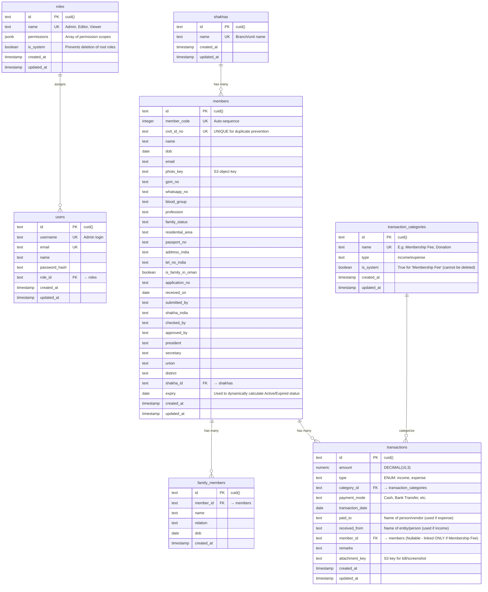

# Database Design — SNDP Salalah Membership Portal

> **Database:** PostgreSQL 16 — **ORM:** Drizzle — **Schema-as-code** in `src/lib/db/schema.ts`

---

## Design Principles & Rationale

Based on the new requirements (Finance Module, Membership Duplicate Prevention, Expiry Identification), the database has been redesigned following these best practices:

1.  **Unified Ledger Pattern (Single Source of Truth for Finances)**
    - _Problem:_ The proposal requires tracking "Membership Fees" alongside general "Income & Expense" (Donations, Charity). If these are in separate tables, generating a unified, chronological "Statement List" is complex and slow.
    - _Best Practice:_ We use a single `transactions` table. If the transaction is a membership fee, the `member_id` foreign key is populated. This makes cash flow reporting, pagination, and date-range filtering extremely efficient.
2.  **Derived Timeline Data (No Stale Statuses)**
    - _Problem:_ "No immediate way to distinguish between active and expired memberships." If we store a `status` column (Active/Expired), we have to run a daily cron job to update it when an expiry date passes. If the job fails, data becomes inaccurate.
    - _Best Practice:_ We do **not** store an `is_active` boolean or status string in the database. Instead, the status is a _derived property_ calculated at query time (or in the application layer) based on the `expiry` date compared to `CURRENT_DATE`. This guarantees 100% accuracy.
3.  **Strict Data Integrity & Duplicate Prevention**
    - _Problem:_ "Multiple branches can accidentally create duplicate entries."
    - _Best Practice:_ Enforce a `UNIQUE` constraint on the `civil_id_no` at the database level. Even if the frontend validation fails or someone imports data manually, the database will aggressively reject duplicates.
4.  **Auditability & Attachments**
    - _Problem:_ Need to attach bills/screenshots for transactions.
    - _Best Practice:_ S3 `attachment_key` is included in every transaction for strict financial auditing.

---

## Entity-Relationship Diagram

---

## Detailed Table Schemas

### `members`

| Column                                                                            | Type      | Constraints          | Notes                                                                                                              |
| --------------------------------------------------------------------------------- | --------- | -------------------- | ------------------------------------------------------------------------------------------------------------------ |
| `id`                                                                              | `text`    | PK, `cuid()`         | Primary identity                                                                                                   |
| `member_code`                                                                     | `integer` | UNIQUE               | Auto-generated standard ID                                                                                         |
| `civil_id_no`                                                                     | `text`    | **UNIQUE**, NOT NULL | **Prevents duplicate registrations**                                                                               |
| `name`                                                                            | `text`    | NOT NULL             |                                                                                                                    |
| `expiry`                                                                          | `date`    | nullable             | **Used to compute Active/Expired. UI auto-suggests +1 year on renewal, but admin can override. `NULL` = Lifetime** |
| `shakha_id`                                                                       | `text`    | FK → shakhas         |                                                                                                                    |
| `photo_key`                                                                       | `text`    | nullable             | S3 Key                                                                                                             |
| _(...other demographic fields like blood_group, gsm_no, etc as per legacy model)_ |           |                      |                                                                                                                    |

**Indexes:** `(civil_id_no)` (Unique), `(member_code)`, `(expiry)` (For date-range filtering), `(shakha_id)`.

### `transaction_categories` (Dynamic Categories)

| Column       | Type        | Constraints               | Notes                                  |
| ------------ | ----------- | ------------------------- | -------------------------------------- |
| `id`         | `text`      | PK, `cuid()`              |                                        |
| `name`       | `text`      | UNIQUE, NOT NULL          | E.g., `Membership Fee`, `Charity`      |
| `type`       | `text`      | NOT NULL                  | `income` or `expense`                  |
| `is_system`  | `boolean`   | NOT NULL, default `false` | Protects core categories from deletion |
| `created_at` | `timestamp` | NOT NULL, default `now()` |                                        |
| `updated_at` | `timestamp` | NOT NULL, default `now()` |                                        |

### `transactions` (Unified Ledger)

| Column             | Type            | Constraints                 | Notes                                               |
| ------------------ | --------------- | --------------------------- | --------------------------------------------------- |
| `id`               | `text`          | PK, `cuid()`                |                                                     |
| `type`             | `text`          | NOT NULL                    | `income` or `expense`                               |
| `category_id`      | `text`          | FK → transaction_categories | Links to dynamic category                           |
| `amount`           | `numeric(10,3)` | NOT NULL                    | Strict financial precision                          |
| `transaction_date` | `date`          | NOT NULL                    | For chronological statement list                    |
| `payment_mode`     | `text`          | NOT NULL                    | **`cash` or `bank` (Vital for Liquidity Tracking)** |
| `paid_to`          | `text`          | nullable                    | Name of vendor/person (used if expense)             |
| `received_from`    | `text`          | nullable                    | Name of entity/person (used if income)              |
| `member_id`        | `text`          | FK → members, nullable      | Linked ONLY if this is a Membership Fee             |
| `remarks`          | `text`          | nullable                    |                                                     |
| `attachment_key`   | `text`          | nullable                    | S3 key for uploaded receipts/bills                  |
| `created_at`       | `timestamp`     | NOT NULL, default `now()`   |                                                     |
| `updated_at`       | `timestamp`     | NOT NULL, default `now()`   |                                                     |

**Indexes:**

- `(transaction_date DESC)`: Crucial for the chronological statement list.
- `(type, category_id)`: For income/expense aggregate reporting.
- `(member_id)`: To quickly load a member's payment history.

### `family_members`

_(Normalizes the embedded array into a proper relational table to ensure strict data types and easier querying)_

### `shakhas`

_(Lookup table for branches)_

### `roles` (RBAC - Role Based Access Control)

_(Allows granular permission checking like `policies.can_delete_members`)_
| Column | Type | Constraints | Notes |
|---|---|---|---|
| `id` | `text` | PK, `cuid()` | |
| `name` | `text` | UNIQUE, NOT NULL | e.g. `Super Admin`, `Data Entry` |
| `permissions` | `jsonb` | NOT NULL, default `[]` | Array of strings (e.g., `['finance:read', 'members:write']`) |
| `is_system` | `boolean` | NOT NULL, default `false` | Prevents deleting the Super Admin role |
| `created_at` | `timestamp` | NOT NULL | |
| `updated_at` | `timestamp` | NOT NULL | |

### `users`

_(Standard Auth.js table for Admin access and session management. Included to show relationships.)_
| Column | Type | Constraints | Notes |
|---|---|---|---|
| `id` | `text` | PK, `cuid()` | |
| `username` | `text` | UNIQUE, NOT NULL | Admin login |
| `email` | `text` | UNIQUE, NOT NULL | |
| `password_hash` | `text` | NOT NULL | bcrypt/argon2 hash |
| `role_id` | `text` | FK → roles, NOT NULL | Links to RBAC system |
| `created_at` | `timestamp` | NOT NULL | |
| `updated_at` | `timestamp` | NOT NULL | |
