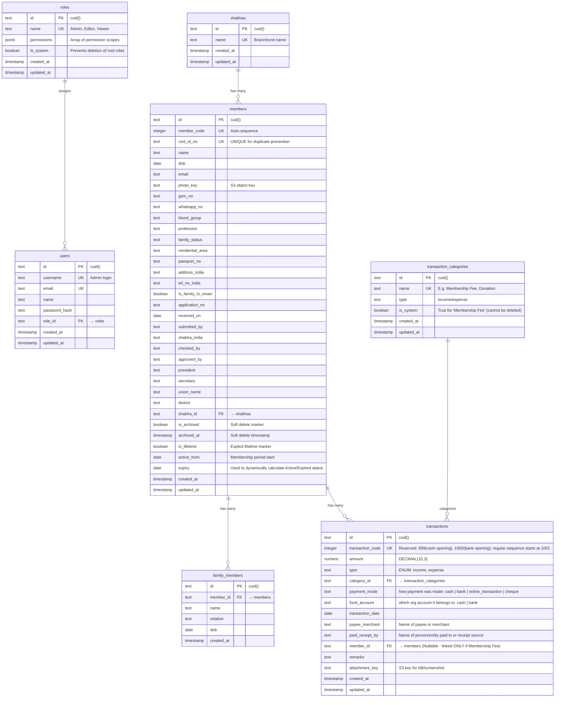

# Database Design — SNDP Salalah Membership Portal

> **Database:** PostgreSQL 16 — **ORM:** Drizzle — **Schema-as-code** in `src/lib/db/schema.ts`

---

## Connection & Env

- **Driver:** `pg` pool (`node-postgres`) via Drizzle `node-postgres`.
- **Env var:** `DATABASE_URL` (validated with Zod before DB initialization).
- **Transaction support:** Server Actions use DB transactions through the pooled `pg` client in Node runtime.
- **Schema source of truth:** `src/lib/db/schema.ts`.
- **Environment separation:** use Neon branches (e.g., `dev` and `production`) with branch-specific connection strings.
- **Local env files:** `.env.development` for dev branch and `.env.production` for prod branch (optional local prod testing).
- **Prod deploys:** run migrations against the prod branch `DATABASE_URL` during deployment (e.g., Vercel).
- **Attachment storage split:** PostgreSQL stores only `attachment_key` metadata; binary files are stored in private S3 buckets.
- **Attachment env vars:** `AWS_REGION`, `S3_TRANSACTIONS_BUCKET`, `AWS_ACCESS_KEY_ID`, `AWS_SECRET_ACCESS_KEY`, `ATTACHMENT_MAX_BYTES`.

---

## Design Principles & Rationale

Based on the new requirements (Finance Module, Membership Duplicate Prevention, Expiry Identification), the database has been redesigned following these best practices:

1.  **Unified Ledger Pattern (Single Source of Truth for Finances)**
    - _Problem:_ The proposal requires tracking "Membership Fees" alongside general "Income & Expense" (Donations, Charity). If these are in separate tables, generating a unified, chronological "Statement List" is complex and slow.
    - _Best Practice:_ We use a single `transactions` table. If the transaction is a membership fee, the `member_id` foreign key is populated. This makes cash flow reporting, pagination, and date-range filtering extremely efficient.
2.  **Derived Timeline Data (No Stale Statuses)**
    - _Problem:_ "No immediate way to distinguish between active and expired memberships." If we store a `status` column (Active/Expired), we have to run a daily cron job to update it when an expiry date passes. If the job fails, data becomes inaccurate.
      - _Best Practice:_ We do **not** store an `is_active` boolean or status string in the database. Instead, status is a _derived property_ calculated at query time using `is_lifetime`, `expiry`, and presence of pending payment transactions:
        - `Lifetime` when `is_lifetime = true`
        - `Pending` when `is_lifetime = false` and (`expiry IS NULL` or a pending payment transaction exists)
        - Date-based (`Active` / `Near Expiry` / `Expired`) when `is_lifetime = false`, `expiry IS NOT NULL`, and no pending payment transaction exists
          This guarantees accuracy while remaining legacy-safe for members created before transaction linkage.
3.  **Strict Data Integrity & Duplicate Prevention**
    - _Problem:_ "Multiple branches can accidentally create duplicate entries."
    - _Best Practice:_ Enforce a `UNIQUE` constraint on the `civil_id_no` at the database level. Even if the frontend validation fails or someone imports data manually, the database will aggressively reject duplicates.
4.  **Auditability & Attachments**
    - _Problem:_ Need to attach bills/screenshots for transactions.
    - _Best Practice:_ S3 `attachment_key` is included in every transaction for strict financial auditing.

---

## Entity-Relationship Diagram



---

## Detailed Table Schemas

### `members`

| Column                                                                            | Type        | Constraints               | Notes                                                                                                            |
| --------------------------------------------------------------------------------- | ----------- | ------------------------- | ---------------------------------------------------------------------------------------------------------------- |
| `id`                                                                              | `text`      | PK, `cuid()`              | Primary identity                                                                                                 |
| `member_code`                                                                     | `integer`   | UNIQUE                    | Auto-generated standard ID                                                                                       |
| `civil_id_no`                                                                     | `text`      | **UNIQUE**, NOT NULL      | **Prevents duplicate registrations**                                                                             |
| `name`                                                                            | `text`      | NOT NULL                  |                                                                                                                  |
| `is_archived`                                                                     | `boolean`   | NOT NULL, default `false` | Soft archive marker used instead of hard delete.                                                                 |
| `archived_at`                                                                     | `timestamp` | nullable                  | Set when a member is archived.                                                                                   |
| `is_lifetime`                                                                     | `boolean`   | NOT NULL, default `false` | Explicit lifetime flag. Prevents ambiguity with unregistered members.                                            |
| `active_from`                                                                     | `date`      | nullable                  | Membership period start date used for activity-window filtering. `NULL` for members not yet registered.          |
| `expiry`                                                                          | `date`      | nullable                  | `NULL` means **Pending** when `is_lifetime = false`. First registration sets initial expiry; renewals update it. |
| `shakha_id`                                                                       | `text`      | FK → shakhas              |                                                                                                                  |
| `photo_key`                                                                       | `text`      | nullable                  | S3 Key                                                                                                           |
| `union_name`                                                                      | `text`      | nullable                  | Stores the member's India-unit union name. Renamed from reserved SQL keyword `union`.                            |
| _(...other demographic fields like blood_group, gsm_no, etc as per legacy model)_ |             |                           |                                                                                                                  |

Phase 1 note: UI enforces photo as mandatory during member creation, while `photo_key` remains nullable in schema to support migration and existing legacy rows. A temporary upload adapter provides a stable key format that will be switched to S3-backed keys later without changing member payload shape.

Migration integrity note: after any bulk import that writes explicit `member_code` values, reseed `members_member_code_seq` to at least `MAX(member_code)` before allowing new inserts. This prevents false duplicate failures caused by sequence drift.

Lifecycle note: Add Member no longer sets membership dates. New records start with `is_lifetime = false`, `active_from = NULL`, and `expiry = NULL` (Pending). First registration sets both dates; renewals move the membership period forward.

**Indexes:** `(civil_id_no)` (Unique), `(member_code)` (Unique), `(active_from)`, `(expiry)` (For activity-window filtering), `(shakha_id)`, trigram expression indexes on `lower(name)`, `lower(email)`, and `lower(whatsapp_no)` for case-insensitive contains search.

### `family_members`

| Column       | Type        | Constraints               | Notes                                              |
| ------------ | ----------- | ------------------------- | -------------------------------------------------- |
| `id`         | `text`      | PK, `cuid()`              |                                                    |
| `member_id`  | `text`      | FK → members, NOT NULL    | Cascade delete when parent member is removed later |
| `name`       | `text`      | NOT NULL                  |                                                    |
| `relation`   | `text`      | nullable                  | Legacy free-text relation label                    |
| `dob`        | `date`      | nullable                  |                                                    |
| `created_at` | `timestamp` | NOT NULL, default `now()` | Preserved/assigned during migration                |
| `updated_at` | `timestamp` | NOT NULL, default `now()` | Updated when a family member row is edited later   |

This table replaces the embedded family member array from MongoDB and is required before running the member migration script.

### `transaction_categories` (Dynamic Categories)

| Column       | Type        | Constraints               | Notes                                  |
| ------------ | ----------- | ------------------------- | -------------------------------------- |
| `id`         | `text`      | PK, `cuid()`              |                                        |
| `name`       | `text`      | UNIQUE, NOT NULL          | E.g., `Membership Fee`, `Charity`      |
| `type`       | `text`      | NOT NULL                  | `income` or `expense`                  |
| `is_system`  | `boolean`   | NOT NULL, default `false` | Protects core categories from deletion |
| `created_at` | `timestamp` | NOT NULL, default `now()` |                                        |
| `updated_at` | `timestamp` | NOT NULL, default `now()` |                                        |

Query-time computed field used by UI/actions:

- `transactionCount` (computed): aggregated count of rows in `transactions` grouped by `category_id`; it is not persisted as a column in `transaction_categories`.

### `transactions` (Unified Ledger)

| Column             | Type            | Constraints                 | Notes                                                                                                               |
| ------------------ | --------------- | --------------------------- | ------------------------------------------------------------------------------------------------------------------- |
| `id`               | `text`          | PK, `cuid()`                |                                                                                                                     |
| `transaction_code` | `integer`       | UNIQUE, NOT NULL            | Reserved fixed codes for opening balances (`cash`=`999`, `bank`=`1000`); regular transactions increment from `1001` |
| `entry_kind`       | `text`          | NOT NULL                    | `regular` or `opening_balance`                                                                                      |
| `type`             | `text`          | nullable                    | `income` or `expense` (only for `regular` entries)                                                                  |
| `category_id`      | `text`          | FK → transaction_categories | Links to dynamic category                                                                                           |
| `amount`           | `numeric(10,3)` | NOT NULL                    | Strict financial precision                                                                                          |
| `transaction_date` | `date`          | NOT NULL                    | For chronological statement list                                                                                    |
| `payment_mode`     | `text`          | nullable                    | `cash`, `bank`, `online_transaction`, or `cheque` — how the payment was made                                        |
| `fund_account`     | `text`          | NOT NULL                    | **`cash` or `bank` — which org account the money belongs to (independent of payment mode)**                         |
| `payee_merchant`   | `text`          | NOT NULL                    | Name of payee or merchant                                                                                           |
| `paid_receipt_by`  | `text`          | NOT NULL                    | Name of person/entity paid to or receipt source                                                                     |
| `member_id`        | `text`          | FK → members, nullable      | Linked ONLY if this is a Membership Fee                                                                             |
| `remarks`          | `text`          | nullable                    |                                                                                                                     |
| `attachment_key`   | `text`          | nullable                    | S3 key for uploaded receipts/bills                                                                                  |
| `created_at`       | `timestamp`     | NOT NULL, default `now()`   |                                                                                                                     |
| `updated_at`       | `timestamp`     | NOT NULL, default `now()`   |                                                                                                                     |

**Enforcement Constraints (PostgreSQL):**

- Keep opening balances in the same `transactions` table and enforce semantics with DB constraints (not app logic alone).
- Reserve transaction codes: `999` for cash opening balance and `1000` for bank opening balance.
- Enforce one opening balance row per fund account.

```sql
-- 1) Domain checks
ALTER TABLE transactions
    ADD CONSTRAINT transactions_entry_kind_check
    CHECK (entry_kind IN ('regular', 'opening_balance'));

ALTER TABLE transactions
    ADD CONSTRAINT transactions_type_check
    CHECK (type IS NULL OR type IN ('income', 'expense'));

ALTER TABLE transactions
    ADD CONSTRAINT transactions_payment_mode_check
    CHECK (
        payment_mode IS NULL OR payment_mode IN ('cash', 'bank', 'online_transaction', 'cheque')
    );

ALTER TABLE transactions
    ADD CONSTRAINT transactions_fund_account_check
    CHECK (fund_account IN ('cash', 'bank'));

-- 2) Shape constraints per entry kind
ALTER TABLE transactions
    ADD CONSTRAINT transactions_regular_shape_check
    CHECK (
        (entry_kind = 'regular' AND type IS NOT NULL AND category_id IS NOT NULL)
        OR
        (entry_kind = 'opening_balance' AND type IS NULL AND category_id IS NULL AND payment_mode IS NULL)
    );

-- 3) Reserved code policy for opening balances + regular range
ALTER TABLE transactions
    ADD CONSTRAINT transactions_opening_code_check
    CHECK (
        (entry_kind = 'opening_balance' AND (
            (fund_account = 'cash' AND transaction_code = 999) OR
            (fund_account = 'bank' AND transaction_code = 1000)
        ))
        OR
        (entry_kind = 'regular' AND transaction_code >= 1001)
    );

-- 4) Exactly one opening balance row per fund account
CREATE UNIQUE INDEX transactions_opening_balance_unique_fund_idx
    ON transactions (fund_account)
    WHERE entry_kind = 'opening_balance';
```

**Computed Fields (Query-Time Only):**

- `balance` (derived): Running cumulative balance at each transaction, computed via SQL window function. **Not persisted.**
- Opening-balance rows participate in running-balance computation but are excluded from income/expense summary totals.
- Direction rule (critical): accumulate in ledger order from oldest to newest using deterministic tie-breakers.
- Formula (per fund account): `SUM(CASE WHEN type = 'income' THEN amount ELSE -amount END) OVER (PARTITION BY fund_account ORDER BY transaction_date ASC, created_at ASC, transaction_code ASC)`
- Balance is tracked **per fund account** — cash-fund rows and bank-fund rows each have their own independent running total.
- Display rule: statement list may still render newest-first for usability; derived balance remains historically correct for each row.
- Filter rule: balance is always computed from the global ledger, even when search/filters are active. Filters only affect row visibility; balance values remain globally correct for each visible row.

**Indexes:**

- `(transaction_date DESC)`: Crucial for the chronological statement list.
- `(type, category_id)`: For income/expense aggregate reporting.
- `(member_id)`: To quickly load a member's payment history.

Attachment behavior rules:

- `attachment_key` stores object key only (not public URL).
- Attachments are private and accessed via pre-signed GET URLs at runtime.
- Initial upload constraints: `application/pdf`, `image/jpeg`, `image/png`; default max file size is 1 MB (`ATTACHMENT_MAX_BYTES=1048576`).

### `family_members`

_(Normalizes the embedded array into a proper relational table to ensure strict data types and easier querying)_

### `shakhas`

_(Lookup table for branches)_

### `roles` (RBAC - Role Based Access Control)

_(Allows granular permission checking like `policies.can_delete_members`)_
| Column | Type | Constraints | Notes |
|---|---|---|---|
| `id` | `text` | PK, `cuid()` | |
| `name` | `text` | UNIQUE, NOT NULL | e.g. `Super Admin`, `Data Entry` |
| `permissions` | `jsonb` | NOT NULL, default `[]` | Array of strings (e.g., `['finance:read', 'members:write']`) |
| `is_system` | `boolean` | NOT NULL, default `false` | Prevents deleting the Super Admin role |
| `created_at` | `timestamp` | NOT NULL | |
| `updated_at` | `timestamp` | NOT NULL | |

### `users`

_(Standard Auth.js table for Admin access and session management. Included to show relationships.)_
| Column | Type | Constraints | Notes |
|---|---|---|---|
| `id` | `text` | PK, `cuid()` | |
| `username` | `text` | UNIQUE, NOT NULL | Admin login |
| `email` | `text` | UNIQUE, NOT NULL | |
| `password_hash` | `text` | NOT NULL | bcrypt/argon2 hash |
| `role_id` | `text` | FK → roles, NOT NULL | Links to RBAC system |
| `created_at` | `timestamp` | NOT NULL | |
| `updated_at` | `timestamp` | NOT NULL | |

---

## Module Integration Status

### Members Module ✅ DB-Integrated

The members module (`src/lib/actions/members.ts`) is fully integrated with the database:

**Tables in Use:**

- `members` — Core member records with soft-delete support, lifetime flags, and membership period tracking
- `family_members` — Dependent family member details (cascade-deleted when parent member is deleted)
- `shakhas` — Lookup table for branch/office assignment

**Operations Implemented:**

- `fetchShakhaOptions()` — Queries shakhas table for dropdown population
- `fetchMembers()` — Paginated search with SQL-derived status filtering (no stored status column), parallel data + count queries
- `fetchMemberById()` — Relational query with family members and computed status
- `createMember()` — Atomic transaction inserting member + family members; catches PostgreSQL `23505` (civil_id_no uniqueness)
- `updateMember()` — Transaction-based update with civil ID re-uniqueness check and family member replacement
- `updateMemberPhoto()` — Direct photo_key update
- `setMemberLifetime()` — Sets lifetime flag and clears expiry dates
- `archiveMember()` — Soft-delete via is_archived + archived_at timestamp
- `deleteMember()` — Hard delete with cascade to family_members

**Hybrid Operations (Partial DB Integration):**

- `renewMembership()` — Member expiry updates persist to DB; transaction creation remains on mock until transactions table is schema-integrated
- `fetchMemberTransactions()` — Mocked; awaits transactions table integration

**Status Derivation:**
Status is computed at query time using `is_lifetime`, `expiry`, and presence of pending payment transactions:

- `lifetime` — `is_lifetime = true`
- `pending` — `is_lifetime = false AND (expiry IS NULL OR pending_payment_exists)`
- `active` — `is_lifetime = false AND expiry > (CURRENT_DATE + INTERVAL '30 days') AND NOT pending_payment_exists` (SQL-derived)
- `near-expiry` — `is_lifetime = false AND expiry >= CURRENT_DATE AND expiry <= (CURRENT_DATE + INTERVAL '30 days') AND NOT pending_payment_exists` (SQL-derived)
- `expired` — `is_lifetime = false AND expiry < CURRENT_DATE AND NOT pending_payment_exists` (SQL-derived)

**UI Integration:**

- `/members` page loads members list from DB with search, filtering, and pagination
- `/members/new` and `/members/[id]` pages fetch shakha options from `fetchShakhaOptions()` action
- Member status badges use `getMemberStatus()` pure utility (no mock dependency)

**Next Steps (When Transactions Table is Schema-Integrated):**

- Integrate `fetchMemberTransactions()` with DB query instead of mock
- Complete `renewMembership()` by inserting transactions to DB instead of mock array
- Add re-check guard to `deleteMember()` for linked transaction validation
